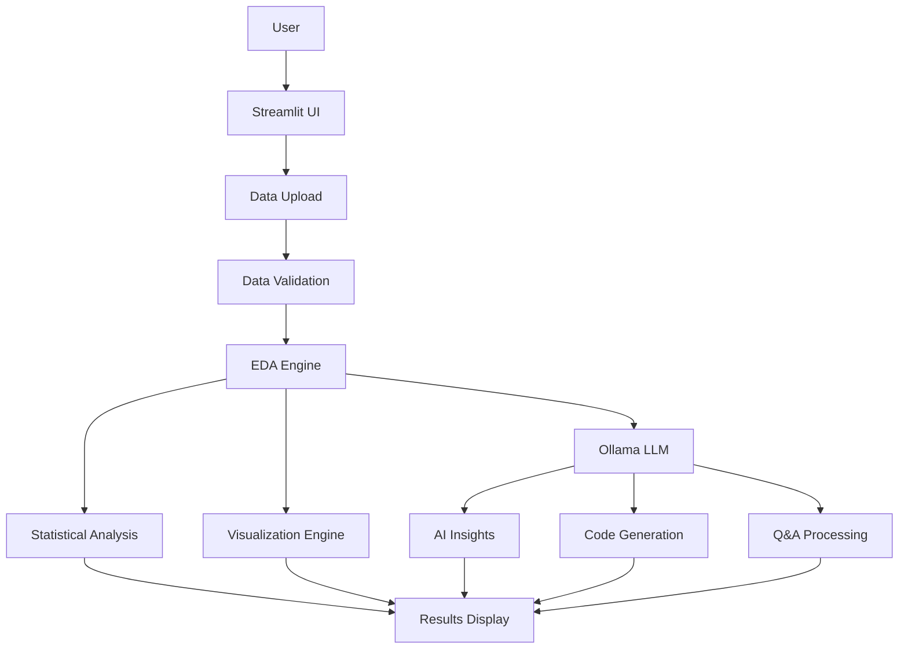

# 🔒 Local EDA Assistant - Secure Data Analysis with AI

A powerful, completely local data analysis application that combines automated exploratory data analysis (EDA) with AI-powered insights. All processing happens on your machine - your data never leaves your computer.


## 📋 Table of Contents
- [Features](#-features)
- [Architecture](#-architecture)
- [Prerequisites](#-prerequisites)
- [Installation](#-installation)
- [Configuration](#-configuration)
- [Usage](#-usage)
- [Features Deep Dive](#-features-deep-dive)
- [Supported File Types](#-supported-file-types)
- [Troubleshooting](#-troubleshooting)
- [Project Structure](#-project-structure)
- [Contributing](#-contributing)
- [Security & Privacy](#-security--privacy)
- [License](#-license)

## ✨ Features

### 🔒 **Complete Privacy**
- 100% local processing - no cloud APIs
- Data never leaves your machine
- No external dependencies for analysis
- Secure file handling with validation

### 📊 **Comprehensive EDA**
- **Automatic Statistical Analysis**
  - Descriptive statistics for all columns
  - Missing value detection and patterns
  - Outlier identification using IQR method
  - Correlation analysis with heatmaps
  - Distribution analysis with histograms and box plots

### 🤖 **AI-Powered Intelligence**
- **Smart Visualizations**
  - AI generates 8-10 custom visualizations based on your data
  - Automatic chart type selection based on data characteristics
  - Interactive Plotly charts with descriptions and use cases
  
- **Natural Language Q&A**
  - Ask questions in plain English
  - Intelligent question refinement for clarity
  - Actual data computation (not just descriptions)
  - Results with data tables and CSV export
  
- **Code Generation**
  - Generates Python code for any analysis
  - Custom analysis workflows
  - Ready-to-use scripts with error handling

### 📈 **Visualization Suite**
- Distribution plots (histograms, box plots)
- Correlation matrices
- Time series analysis
- Categorical data charts
- Missing data visualization
- Scatter matrices for multivariate analysis
- All charts include descriptions and use cases

## 🏗 Architecture



## 📦 Prerequisites

### System Requirements
- **Python:** 3.8 or higher
- **RAM:** Minimum 8GB (16GB recommended for large datasets)
- **Storage:** 10GB free space for models
- **OS:** Windows, macOS, or Linux

### Required Software
1. **Ollama** - Local LLM runtime
2. **Python** - Programming language
3. **Git** - Version control (optional)

## 🚀 Installation

### Step 1: Clone the Repository
```bash
git clone https://github.com/yourusername/EDA_APP.git
cd EDA_APP
```

### Step 2: Set Up Python Environment
```bash
# Create virtual environment
python -m venv venv

# Activate virtual environment
# On Windows:
venv\Scripts\activate
# On macOS/Linux:
source venv/bin/activate

# Install dependencies
pip install -r requirements.txt
```

### Step 3: Install and Configure Ollama

#### On macOS:
```bash
# Install Ollama
curl -fsSL https://ollama.ai/install.sh | sh

# Start Ollama service
ollama serve

# In a new terminal, pull a model
ollama pull llama2:13b
```

#### On Windows:
1. Download Ollama from [https://ollama.ai/download](https://ollama.ai/download)
2. Run the installer
3. Open Command Prompt and run:
```cmd
ollama serve
# In a new terminal:
ollama pull llama2:13b
```

#### On Linux:
```bash
# Install Ollama
curl -fsSL https://ollama.ai/install.sh | sh

# Start Ollama service
systemctl start ollama

# Pull a model
ollama pull llama2:13b
```

### Step 4: Configure Environment
Create a `.env` file in the project root:

```bash
# .env file
OLLAMA_MODEL=llama2:13b
OLLAMA_BASE_URL=http://localhost:11434
```

### Step 5: Verify Installation
```bash
# Check Ollama is running
curl http://localhost:11434/api/tags

# Test the application
streamlit run app.py
```

## ⚙ Configuration

### Environment Variables

| Variable | Description | Default | Options |
|----------|-------------|---------|---------|
| `OLLAMA_MODEL` | LLM model to use | `llama2:13b` | `llama2:7b`, `llama2:13b`, `mistral:7b`, `mixtral:8x7b` |
| `OLLAMA_BASE_URL` | Ollama API endpoint | `http://localhost:11434` | Any valid URL |

### Recommended Models

| Model | Size | Speed | Quality | Use Case |
|-------|------|-------|---------|----------|
| `llama2:7b` | 4GB | Fast | Good | Quick analysis, basic questions |
| `llama2:13b` | 8GB | Medium | Better | **Recommended** - Balanced performance |
| `mistral:7b` | 4GB | Fast | Good | Code generation focus |
| `mixtral:8x7b` | 26GB | Slow | Excellent | Complex analysis, best quality |

## 📖 Usage

### Starting the Application

1. **Start Ollama** (if not already running):
```bash
ollama serve
```

2. **Launch the application**:
```bash
streamlit run app.py
```

3. **Open your browser** to `http://localhost:8501`

### Basic Workflow

#### 1. Upload Your Data
- Click on "Choose a file" in the sidebar
- Select CSV, Excel, or JSON file (up to 100MB)
- Wait for validation and cleaning

#### 2. Explore Overview Tab
- View basic statistics
- Check data shape and memory usage
- Review column information
- See missing data summary

#### 3. Generate AI Visualizations
- Go to "Visualizations" tab
- Click "Generate Visualizations"
- AI analyzes your data and creates custom charts
- Each chart includes descriptions and use cases

#### 4. Ask Questions (Q&A Tab)
- Enter your question in natural language
- Review the refined question
- Get computed answers with actual data
- Download results as CSV

#### 5. Generate Analysis Code
- Go to "Generated Code" tab
- Select analysis type or custom request
- Get production-ready Python code
- Download for use in your projects

## 🔍 Features Deep Dive

### Smart Question Refinement

The Q&A system uses a three-stage process:

1. **Input Stage**
   - User asks: "show me top customers"
   
2. **Refinement Stage**
   - AI refines to: "Which CUSTOMERNAME has the highest total SALES amount?"
   - User can edit or accept
   
3. **Execution Stage**
   - Generates analysis code
   - Executes on full dataset
   - Returns: "Customer ABC has highest sales of $1,234,567"
   - Shows top 5 customers table

### AI Visualization Generation

The system generates visualizations based on data characteristics:

- **Numeric Data** → Distribution plots, box plots, histograms
- **Categorical Data** → Bar charts, frequency plots
- **Time Series** → Line charts, trend analysis
- **Correlations** → Heatmaps, scatter plots
- **Geographic** → Maps (if location data detected)

Each visualization includes:
- Interactive Plotly chart
- Descriptive explanation
- Use case guidance
- Generated Python code

### Data Validation & Cleaning

Automatic preprocessing includes:
- Missing value detection
- Duplicate row identification
- Data type inference
- Outlier detection (IQR method)
- Encoding detection for CSV files

## 📁 Supported File Types

| Format | Extensions | Max Size | Notes |
|--------|------------|----------|--------|
| CSV | `.csv` | 100MB | Auto-detects encoding |
| Excel | `.xlsx`, `.xls` | 100MB | All sheets combined |
| JSON | `.json` | 100MB | Nested structures flattened |

## 🔧 Troubleshooting

### Common Issues

#### Ollama Connection Error
```
Error: Cannot connect to Ollama at http://localhost:11434
```
**Solution:**
1. Check Ollama is running: `ollama serve`
2. Verify URL in `.env` file
3. Check firewall settings

#### Model Not Found
```
Error: Model 'llama2:13b' not found
```
**Solution:**
```bash
ollama pull llama2:13b
ollama list  # Verify model is downloaded
```

#### Memory Error with Large Files
**Solution:**
- Reduce `MAX_ROWS_FOR_ANALYSIS` in settings
- Use a smaller sample size
- Increase system RAM

#### Slow Response Times
**Solution:**
- Use a smaller model (`llama2:7b` instead of `13b`)
- Reduce visualization count
- Check CPU/RAM usage

### Logs and Debugging

Enable debug mode by setting:
```python
# In app.py, add at the top:
import streamlit as st
st.set_option('server.logLevel', 'debug')
```

Check Ollama logs:
```bash
# Linux/macOS
journalctl -u ollama -f

# Windows - Check Event Viewer
```

## 📂 Project Structure

```
EDA_APP/
├── .env                    # Environment configuration (create this)
├── .gitignore             # Git ignore rules
├── README.md              # This file
├── requirements.txt       # Python dependencies
├── app.py                # Main application entry point
│
├── config/               
│   ├── __init__.py
│   └── settings.py       # Application settings
│
├── src/
│   ├── __init__.py
│   │
│   ├── data_handler/     # Data processing modules
│   │   ├── __init__.py
│   │   ├── loader.py     # File loading logic
│   │   └── validator.py  # Data validation
│   │
│   ├── eda/              # Analysis modules
│   │   ├── __init__.py
│   │   ├── analyzer.py   # Statistical analysis
│   │   └── visualizer.py # Chart generation
│   │
│   ├── llm/              # AI integration
│   │   ├── __init__.py
│   │   └── ollama_client.py # LLM interface
│   │
│   └── utils/            # Utility functions
│       ├── __init__.py
│       ├── code_executor.py # Safe code execution
│       └── security.py      # Security utilities
│
└── tests/                # Test files
    ├── __init__.py
    └── test_data_handler.py
```

## 🤝 Contributing

We welcome contributions! Please follow these steps:

1. Fork the repository
2. Create a feature branch (`git checkout -b feature/AmazingFeature`)
3. Commit your changes (`git commit -m 'Add some AmazingFeature'`)
4. Push to the branch (`git push origin feature/AmazingFeature`)
5. Open a Pull Request

### Development Setup

```bash
# Install development dependencies
pip install -r requirements-dev.txt

# Run tests
pytest tests/

# Format code
black src/ tests/

# Lint code
flake8 src/ tests/
```

## 🔐 Security & Privacy

### Data Privacy Guarantees
- ✅ **No Cloud APIs**: All processing is local
- ✅ **No Telemetry**: No usage data collected
- ✅ **No External Requests**: Except Ollama on localhost
- ✅ **Secure File Handling**: Input validation and sanitization
- ✅ **Code Sandboxing**: Generated code runs in restricted environment

### Security Best Practices
1. Keep your Ollama installation updated
2. Don't expose the Streamlit port to the internet
3. Validate all uploaded files before processing
4. Review generated code before running elsewhere
5. Use environment variables for sensitive configuration

## 📄 License

This project is licensed under the MIT License - see the [LICENSE](LICENSE) file for details.

## 🙏 Acknowledgments

- [Streamlit](https://streamlit.io/) - UI framework
- [Ollama](https://ollama.ai/) - Local LLM runtime
- [Plotly](https://plotly.com/) - Interactive visualizations
- [Pandas](https://pandas.pydata.org/) - Data manipulation
- [LangChain](https://langchain.com/) - LLM orchestration

## 📞 Support

For issues, questions, or suggestions:
1. Check the [Troubleshooting](#-troubleshooting) section
2. Search existing [GitHub Issues](https://github.com/yourusername/EDA_APP/issues)
3. Create a new issue with detailed information

## 🚀 Roadmap

- [ ] Support for larger files (>100MB)
- [ ] Additional LLM providers (GPT4All, LlamaCpp)
- [ ] Real-time collaboration features
- [ ] Export to Jupyter notebooks
- [ ] Advanced ML model suggestions
- [ ] Database connectivity (SQL, MongoDB)
- [ ] Custom visualization templates
- [ ] Batch processing capabilities

---

**Built with ❤️ for data analysts who value privacy and control**